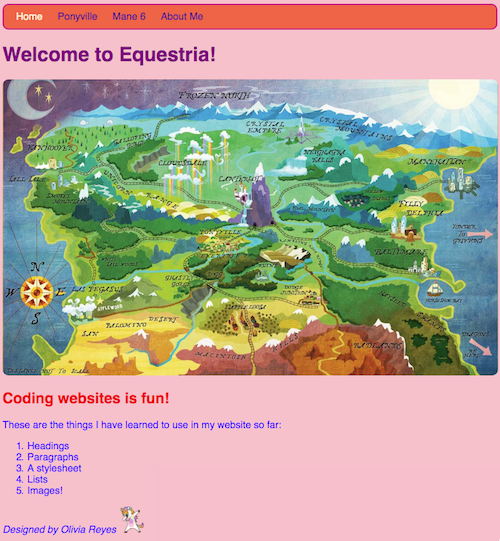
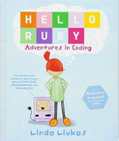
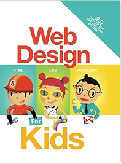

# Olivia's 1st Website
--------------------------------------------
This is the code base for Olivia's 1st Website.

# Overview
--------------------------------------------
One day my little girl asked me to get her a coding book after a school trip to Barnes and Nobles. After giving it some thought in the eyes of my 5 year old, I decided I wanted to teach her how to code a website so that she could see the immediate relation between the back end code and changes on the front end. After doing some searches for early coder sites, I found a great site called [Coder Dojo](https://coderdojo.com/) which had a local 'dojo' to my area. Reading through their free lessons I found a good exercise on [Beginner HTML and CSS](https://legacy.gitbook.com/book/coderdojo/beginner-html-css/details) and decided to loosely follow their plan with my 5 year old daughter. After she started seeing some of the easy changes that CSS did with her webpage, she was hooked. She started asking every night to code the next lesson rather than read a bedtime story! It was very easy for her to follow along.

Building the website she learned how HTML builds the page, and CSS gives it style. She learned the difference in **bold** vs _italic_, HTML headers, start/end tags, un/ordered lists, linking pages together, image placement, and even embedded YouTube video.

If anyone is interested in getting their kiddos started with coding, I'd suggest to check out some of the lesson plans on [Coder Dojo](https://coderdojo.com/), see if it sticks, and check out one of their local 'Dojos'.

# References
--------------------------------------------
These are some of the books that Olivia really liked reading. They really help with core concepts.

* [Hello Ruby: Adventures in Coding](http://a.co/hKquy4Q)

* [Web Design for Kids](http://a.co/fkwDu2n)

* [CoderDojo Nano: Building a Website](http://a.co/7A0jw80)
